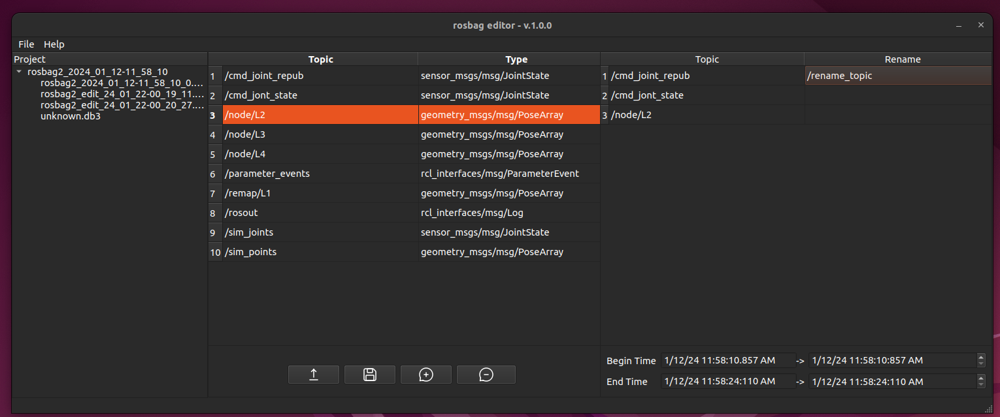

# rosbag2 editor v1.0.0
 
 

rosbag2 editor simplifies rosbag editing for ROS2. GUI is built in C++/Qt6 and exploits rosbag2_cpp library. Developed and (not much) tested on Ubuntu 22.04, ROS2 Humble.

Main features:

- Intuitive interface 
- Rename Topics
- Remove Topics
- Trim Rosbag
- Import directory or file

## Installation 

### [Method 1]: debian package
1. Download the release
2. Paste in a new terminal: `sudo dpkg -i rosbag2-editor_v1.0.0.deb`
3. Source ROS2: `source /opt/ros/humble/setup.bash`
4. Run: `rosbag2-editor`
  
### [Method 2]: AppImage
1. Download the release
2. Make the appimage executable: `chmod a+x rosbag2_editor-v1_0_0-x86-64.AppImage`
3. Source ROS2: `source /opt/ros/humble/setup.bash`
4. Run: `./rosbag2_editor-v1_0_0-x86-64.AppImage`

## How to use it

[TODO]: Needs definition

## Build from source 

[TODO]: Needs definition

# License 

[TODO]: Needs definition

